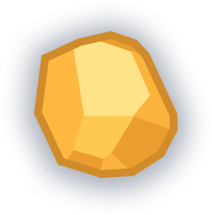

# UFO
UFOは[UFO 2D Tutorial](https://assetstore.unity.com/packages/essentials/tutorial-projects/2d-ufo-tutorial-52143)を使用して作成されたゲームです。

# 遊び方
プレイヤーの目的はステージ上のエネルギーを集めることです。
  
プレイヤーは壁にぶつかるとダメージを受けてしまいます。  
出来るだけぶつからず、出来るだけ取残さず画面右のゴールまで向かうことでより高い評価を得られます。